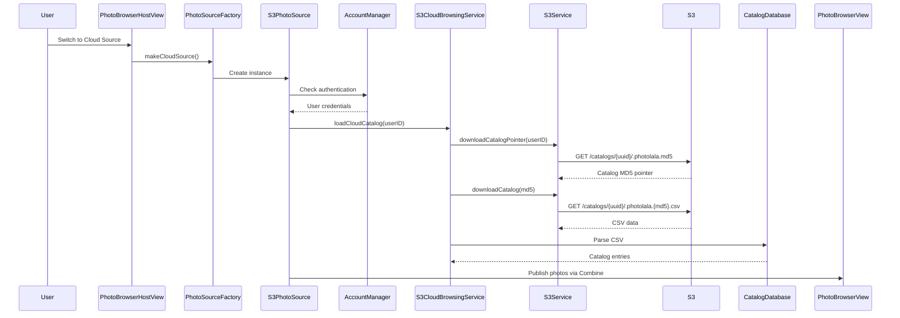
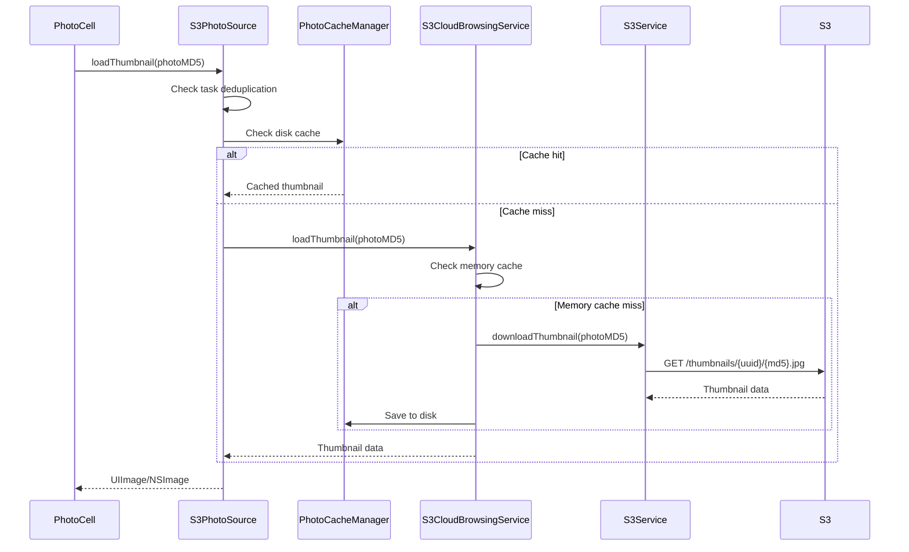

# S3 Cloud Photo Browser Design Document

## Overview

The S3 Cloud Photo Browser provides seamless access to photo collections stored in AWS S3, integrated with Photolala's unified photo browsing architecture. It enables users to browse, view, and manage their cloud-backed photo catalogs with the same experience as local and Apple Photos sources.

## Architecture

### Component Hierarchy

```
PhotoBrowserHostView (Coordinator)
    ├── PhotoSourceFactory (Source Creation)
    │   └── S3PhotoSource (Cloud Implementation)
    │       ├── S3Service (AWS S3 Operations)
    │       ├── S3CloudBrowsingService (Catalog Management)
    │       └── AccountManager (Authentication)
    └── PhotoBrowserView (Pure Rendering)
        └── PhotoCollectionViewRepresentable (Native Collection)
```

### Key Design Principles

1. **Separation of Concerns**: PhotoBrowserHostView manages state and source switching, while PhotoBrowserView handles pure rendering
2. **Protocol-Based Design**: S3PhotoSource implements PhotoSourceProtocol for seamless integration
3. **Progressive Loading**: Thumbnails load from cache first, then S3 on demand
4. **Security-First**: All S3 operations use STS temporary credentials
5. **Platform Awareness**: Handles iOS sandbox and macOS sandboxed environments properly

## Core Components

### 1. S3PhotoSource

**Location**: `apple/Photolala/Sources/S3PhotoSource.swift`

**Responsibilities**:
- Implements PhotoSourceProtocol for cloud photos
- Manages catalog database lifecycle
- Coordinates with S3CloudBrowsingService for data operations
- Publishes photo lists and loading states via Combine

**Key Features**:
- Graceful handling of empty catalogs (new users)
- Concurrent thumbnail loading with task deduplication
- Memory-efficient catalog entry caching

### 2. S3Service

**Location**: `apple/Photolala/Services/S3Service.swift`

**Responsibilities**:
- Low-level AWS S3 operations
- STS credential management
- Environment-aware bucket selection (dev/stage/prod)
- Detailed logging for debugging

**S3 Bucket Structure**:
```
photolala-{environment}/
├── catalogs/
│   └── {user-uuid}/
│       ├── .photolala.md5           # Catalog pointer
│       └── .photolala.{md5}.csv     # Catalog data
├── photos/
│   └── {user-uuid}/
│       └── {photo-md5}              # Full resolution photos
└── thumbnails/
    └── {user-uuid}/
        └── {photo-md5}.jpg          # Thumbnail images
```

### 3. S3CloudBrowsingService

**Location**: `apple/Photolala/Services/S3CloudBrowsingService.swift`

**Responsibilities**:
- Catalog download and parsing
- Progressive thumbnail loading with multi-tier caching
- Memory cache management with size limits

**Cache Hierarchy**:
1. Memory cache (LRU, 50MB limit)
2. Local disk cache (PhotoCacheManager)
3. S3 download (with presigned URLs)

### 4. PhotoSourceFactory

**Location**: `apple/Photolala/Services/PhotoSourceFactory.swift`

**Responsibilities**:
- Platform-aware source creation
- Security-scoped bookmark management for sandboxed environments
- Default source fallback logic

**Security-Scoped Bookmarks**:
- iOS: Always required for folder access
- macOS Sandboxed: Required for folders outside container
- Proper bookmark persistence and resolution on app restart

## Authentication Flow

### Sign-In Process

1. User initiates sign-in from CloudAuthenticationView
2. AccountManager handles Google/Apple OAuth flow
3. Backend returns JWT tokens and user profile
4. STS credentials are fetched for S3 access
5. Credentials auto-refresh before expiration

### Credential Management

```swift
AccountManager (Singleton)
    ├── getCurrentUser() → User profile
    ├── getSTSCredentials() → AWS credentials
    └── signOut() → Clear all auth state
```

## Data Flow

### Loading Photos



### Loading Thumbnails



## Error Handling

### NoSuchKey (Empty Catalog)

**Scenario**: New user with no uploaded photos

**Handling**:
1. S3Service catches AWSS3.NoSuchKey error
2. Logs as expected state for new users
3. S3PhotoSource returns empty array instead of throwing
4. UI shows cloud-specific empty state

### Authentication Errors

**Scenario**: Token expired or user signed out

**Handling**:
1. PhotoSourceError.notAuthorized thrown
2. PhotoBrowserHostView shows authentication sheet
3. After sign-in, source automatically reloads

### Network Failures

**Scenario**: No internet or S3 unavailable

**Handling**:
1. PhotoSourceError.loadFailed with underlying error
2. Error alert shown with retry option
3. Cached content remains available

## Performance Optimizations

### Concurrent Loading
- Thumbnail tasks are deduplicated to prevent redundant downloads
- Multiple thumbnails load concurrently with controlled parallelism

### Memory Management
- Memory cache limited to 50MB with LRU eviction
- Catalog entries stored once, referenced by items
- Task cleanup on view disappear

### Progressive Enhancement
1. Show cached photos immediately
2. Load thumbnails on demand as cells appear
3. Full images only loaded when detail view opened

## Platform Considerations

### iOS Sandbox
- Security-scoped bookmarks for local folders
- Minimal bookmark storage in UserDefaults
- Bookmark resolution with stale handling

### macOS Sandbox
- Same security-scoped bookmark requirements as iOS
- Window-based navigation for multiple photo sources
- Sidebar toggle support

### Cross-Platform
- Unified PhotoSourceProtocol implementation
- Platform-specific image types (UIImage/NSImage)
- Responsive collection view layouts

## Testing Strategy

### Unit Tests
- S3Service credential management
- Catalog parsing and entry mapping
- Cache eviction policies

### Integration Tests
- End-to-end authentication flow
- Catalog download and parsing
- Thumbnail loading with cache

### Manual Testing
- New user experience (empty state)
- Large catalog performance (10K+ photos)
- Offline mode with cached content
- Token refresh during long sessions

## Future Enhancements

### Phase 2
- Upload photos to cloud
- Delete cloud photos
- Sync local changes to cloud
- Conflict resolution

### Phase 3
- Shared albums
- Public link generation
- Activity feed
- Comments and reactions

### Performance
- WebP thumbnail support
- Differential sync for catalog updates
- Background prefetching
- CloudKit integration for iOS

## Security Considerations

1. **Credentials**: Never stored in code or logs
2. **STS Tokens**: Auto-refresh before expiration
3. **Presigned URLs**: Time-limited for downloads
4. **User Isolation**: UUID-based paths prevent cross-user access
5. **Bookmark Security**: Properly scoped for sandbox access

## Monitoring and Logging

### Key Metrics
- Catalog load time
- Thumbnail cache hit rate
- S3 request failures
- Authentication success rate

### Debug Logging
- Detailed S3 operation logs with paths
- Authentication state transitions
- Cache operations and evictions
- Error context with recovery suggestions

## Dependencies

### External
- AWSS3 SDK
- GoogleSignIn
- AuthenticationServices (Sign in with Apple)

### Internal
- PhotoSourceProtocol
- PhotoBrowserEnvironment
- CatalogDatabase
- PhotoCacheManager

## Configuration

### Environment Variables
```swift
enum Environment {
    case development  // photolala-dev
    case staging     // photolala-stage
    case production  // photolala-prod
}
```

### User Defaults Keys
- `lastLocalSourceBookmark`: Security-scoped bookmark data
- `selectedEnvironment`: Current AWS environment
- `thumbnailCacheSize`: Cache size limit

## API Contracts

### PhotoSourceProtocol
```swift
protocol PhotoSourceProtocol {
    func loadPhotos() async throws -> [PhotoBrowserItem]
    func loadMetadata(for itemId: String) async throws -> PhotoBrowserMetadata
    func loadThumbnail(for itemId: String) async throws -> PlatformImage?
    func loadFullImage(for itemId: String) async throws -> Data

    var photosPublisher: AnyPublisher<[PhotoBrowserItem], Never> { get }
    var isLoadingPublisher: AnyPublisher<Bool, Never> { get }
    var capabilities: PhotoSourceCapabilities { get }
}
```

### Catalog Entry Format
```csv
photo_head_md5,file_size,photo_date,format,photo_md5
abc123...,1048576,2024-01-15T10:30:00Z,JPEG,def456...
```

## Conclusion

The S3 Cloud Photo Browser provides a robust, performant, and user-friendly interface for cloud photo management. Its architecture ensures scalability, security, and seamless integration with Photolala's broader ecosystem while maintaining platform-specific optimizations and proper error handling.