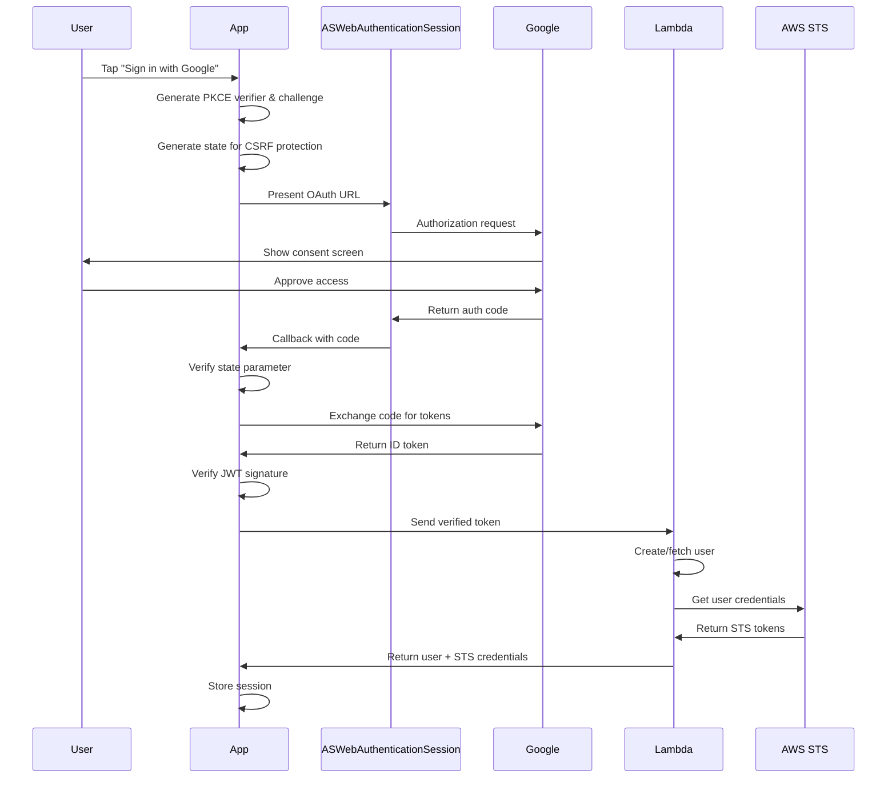

# Google Sign-In Design Document

## Executive Summary

This document outlines the design and implementation of Google Sign-In for Photolala2 as Phase 2 of the multi-provider authentication system. The implementation uses OAuth 2.0 with PKCE for enhanced security, native ASWebAuthenticationSession for the authentication flow, and integrates seamlessly with the existing Lambda-based identity management system.

## Table of Contents

1. [Overview](#overview)
2. [System Architecture](#system-architecture)
3. [Security Design](#security-design)
4. [User Experience](#user-experience)
5. [Technical Implementation](#technical-implementation)
6. [Integration Points](#integration-points)
7. [Error Handling](#error-handling)
8. [Testing Strategy](#testing-strategy)
9. [Future Considerations](#future-considerations)

## Overview

### Purpose
Google Sign-In provides users with an alternative authentication method to Apple Sign-In, expanding accessibility and user choice. It enables users to authenticate using their Google accounts while maintaining the same security standards and user experience as Apple Sign-In.

### Scope
- OAuth 2.0 authentication flow
- JWT token verification with Google's public keys
- Integration with existing AccountManager
- Support for iOS and macOS platforms
- Developer testing tools

### Non-Goals
- Google Sign-In SDK integration (using native APIs instead)
- Google Photos API access
- Google Drive integration
- Social features

## System Architecture

### High-Level Flow



### Component Architecture

```
┌─────────────────────────────────────┐
│         AccountManager              │
│  (Orchestrates authentication)      │
└────────────┬────────────────────────┘
             │
┌────────────▼────────────────────────┐
│    GoogleSignInCoordinator          │
│  (Manages OAuth flow)               │
└────────────┬────────────────────────┘
             │
┌────────────▼────────────────────────┐
│   ASWebAuthenticationSession        │
│  (Native browser authentication)    │
└────────────┬────────────────────────┘
             │
┌────────────▼────────────────────────┐
│      Google OAuth 2.0              │
│  (External authentication)          │
└─────────────────────────────────────┘
```

### Key Components

#### GoogleSignInCoordinator (Actor)
- Manages OAuth state and PKCE parameters
- Handles authorization flow
- Performs token exchange
- Verifies JWT tokens

#### GooglePublicKeyCache (Actor)
- Caches Google's public keys
- Thread-safe key management
- Auto-refresh after expiry

#### GoogleOAuthConfiguration
- Client IDs and endpoints
- OAuth scopes
- Redirect URIs

## Security Design

### OAuth 2.0 with PKCE

PKCE (Proof Key for Code Exchange) prevents authorization code interception attacks:

1. **Code Verifier**: Random 32-byte string (base64url encoded)
2. **Code Challenge**: SHA256(code_verifier), base64url encoded
3. **Method**: S256 (SHA256 hashing)

```swift
// Authorization request includes:
code_challenge=<base64url(SHA256(verifier))>
code_challenge_method=S256

// Token exchange includes:
code_verifier=<original_verifier>
```

### State Parameter

Prevents CSRF attacks:
- Generate random UUID for each auth request
- Store state in coordinator
- Verify state matches in callback
- Reject if mismatch

### Nonce for Replay Protection

Prevents ID token replay attacks (OIDC best practice):

1. **Generation**: Create cryptographically random nonce
2. **Authorization**: Include nonce in authorization request
3. **Token**: Google includes nonce claim in ID token
4. **Verification**: Verify nonce matches expected value

```swift
// Generate nonce (similar to Apple Sign-In)
let nonce = randomNonceString()

// Include in authorization URL
URLQueryItem(name: "nonce", value: nonce)

// Verify in ID token claims
guard verifiedToken.claims.nonce == expectedNonce else {
    throw GoogleSignInError.nonceMismatch
}
```

### JWT Verification

Complete verification process:

1. **Structure Validation**
   - Verify 3-part JWT structure (header.payload.signature)
   - Decode header to get key ID (kid)

2. **Signature Verification**
   - Fetch Google's public keys from `https://www.googleapis.com/oauth2/v3/certs`
   - Cache keys for 1 hour
   - Verify signature with matching key

3. **Claims Validation**
   - **Issuer (iss)**: Must be `https://accounts.google.com` or `accounts.google.com`
   - **Audience (aud)**: Must match our client ID (handles both string and array)
   - **Expiration (exp)**: Must be in the future
   - **Issued At (iat)**: Must not be in the future (±60 seconds tolerance)
   - **Nonce**: Must match the nonce sent in authorization request

### Secure Storage

- STS credentials: Keychain with biometric protection
- User information: Keychain
- No token persistence (tokens are temporary)

## User Experience

### Sign-In Flow

1. **Initiation**
   - User taps "Sign in with Google" button
   - Button shows Google branding per guidelines

2. **Authentication**
   - System browser opens (ASWebAuthenticationSession)
   - User sees Google's consent screen
   - Account selection if multiple accounts
   - Consent for requested scopes

3. **Success**
   - Browser dismisses automatically
   - Loading indicator while verifying
   - Navigate to main app screen
   - Show success message

4. **Failure**
   - Clear error message
   - Option to retry
   - Alternative sign-in methods visible

### Platform Differences

#### iOS
- ASWebAuthenticationSession presents from current view controller
- Ephemeral session (no persistent cookies)
- Automatic callback handling via URL scheme

#### macOS
- ASWebAuthenticationSession presents as sheet
- No fallback to NSWorkspace.open (security)
- Same ephemeral session behavior

## Technical Implementation

### Core Data Structures

```swift
// OAuth token response
struct TokenResponse: Codable, Sendable {
    let idToken: String
    let accessToken: String
    let refreshToken: String?
    let expiresIn: Int
}

// Typed JWT claims structure (Sendable)
struct GoogleJWTClaims: Sendable {
    let subject: String        // sub
    let email: String?
    let emailVerified: Bool?
    let name: String?
    let picture: String?
    let issuer: String         // iss
    let audience: String       // aud (or first element if array)
    let expiration: Date       // exp
    let issuedAt: Date         // iat
    let nonce: String?         // nonce claim for replay protection
}

// Verified token with typed claims
struct VerifiedToken: Sendable {
    let idToken: String
    let claims: GoogleJWTClaims
}

// Final credential
struct GoogleCredential: Sendable {
    let idToken: String
    let accessToken: String
    let claims: GoogleJWTClaims  // Typed claims instead of [String: Any]
}
```

### Concurrency Model

- **GoogleSignInCoordinator**: Actor for thread-safe OAuth state
- **GooglePublicKeyCache**: Actor for thread-safe key caching
- **MainActor**: UI operations only (presenting auth session)
- **Detached Tasks**: Not needed due to actor isolation

### Form Encoding

Proper encoding for `application/x-www-form-urlencoded`:
```swift
let allowedCharacters = CharacterSet(
    charactersIn: "abcdefghijklmnopqrstuvwxyz" +
                  "ABCDEFGHIJKLMNOPQRSTUVWXYZ" +
                  "0123456789-._~"
)
```
Special characters (`+`, `&`, `=`) are properly percent-encoded.

## Integration Points

### AccountManager Integration

```swift
extension AccountManager {
    func signInWithGoogle() async throws -> PhotolalaUser {
        // 1. OAuth flow via coordinator
        let coordinator = GoogleSignInCoordinator()
        let credential = try await coordinator.performSignIn()

        // 2. Send to Lambda
        let payload = [
            "idToken": credential.idToken,
            "provider": "google"
        ]

        // 3. Get user + STS credentials
        let result = try await callAuthLambdaWithData(
            "photolala-auth-signin",
            payloadData: JSONSerialization.data(withJSONObject: payload)
        )

        // 4. Store session
        self.currentUser = result.user
        self.stsCredentials = result.credentials
        self.isSignedIn = true
        await saveSession()

        return result.user
    }
}
```

### Lambda Integration

Same endpoint as Apple Sign-In (`photolala-auth-signin`):
- Accepts Google ID tokens
- Validates token with Google
- Creates/fetches user
- Returns STS credentials

### PhotolalaUser Model

Already supports multi-provider:
```swift
struct PhotolalaUser: Codable, Sendable {
    let id: UUID
    let appleUserID: String?
    let googleUserID: String?  // For Google users
    let email: String?
    let displayName: String
    // ...
}
```

## Error Handling

### Comprehensive Error Cases

```swift
enum GoogleSignInError: LocalizedError {
    // OAuth errors
    case invalidAuthorizationResponse
    case stateMismatch           // CSRF protection
    case noAuthorizationCode
    case tokenExchangeFailed(String)
    case userCancelled

    // JWT verification errors
    case invalidIDToken          // Structure invalid
    case missingKeyID           // No kid in header
    case unknownKeyID           // Key not in Google's set
    case invalidSignature       // Signature verification failed
    case invalidIssuer          // Wrong issuer
    case invalidAudience        // Wrong audience
    case tokenExpired           // Past expiration
    case invalidIssuedAt        // Future issued time
    case nonceMismatch          // Replay protection

    // Platform errors
    case webAuthenticationUnavailable
}
```

### User-Facing Messages

All errors provide localized descriptions suitable for user display.

## Testing Strategy

### Unit Tests
- PKCE generation and validation
- State parameter handling
- JWT decoding (without verification)
- Form encoding edge cases
- Error case coverage

### Integration Tests
- Full OAuth flow (dev environment)
- Token verification with test keys
- Lambda integration
- Session persistence

### Developer Testing

Developer menu support (macOS DEBUG builds):
```swift
#if os(macOS) && DEBUG
"Test Sign-In with Google" menu item:
- Isolated OAuth flow
- Token verification without backend
- Redacted console logging
- No side effects
#endif
```

### Manual Testing Checklist
- [ ] Sign in with single Google account
- [ ] Sign in with multiple accounts (selection)
- [ ] Cancel during authentication
- [ ] Network timeout handling
- [ ] Invalid token handling
- [ ] Session restoration
- [ ] Sign out and re-sign in

## Future Considerations

### Phase 3: Provider Linking
- Link Google account to existing Apple Sign-In user
- Handle conflicts (Google account already linked)
- UI for managing linked accounts

### Enhancements
- Silent sign-in (using refresh token)
- Incremental authorization (request additional scopes)
- Google One Tap sign-in
- Cross-device sign-in

### Monitoring
- Track authentication success rates
- Monitor token verification failures
- Measure authentication latency
- User preference analytics (Apple vs Google)

## Configuration

### Required Setup

1. **Google Cloud Console**
   - OAuth 2.0 Client IDs configured
   - Redirect URIs registered
   - Scopes approved

2. **Info.plist**
   - URL scheme for OAuth callbacks
   - Query schemes for Google Chrome (iOS)

3. **Existing Files**
   - `GoogleOAuthConfiguration.swift` - Configuration constants
   - Client IDs and endpoints already configured

## Appendix

### References
- [OAuth 2.0 RFC 6749](https://tools.ietf.org/html/rfc6749)
- [PKCE RFC 7636](https://tools.ietf.org/html/rfc7636)
- [Google OAuth 2.0 Documentation](https://developers.google.com/identity/protocols/oauth2)
- [OpenID Connect](https://openid.net/connect/)

### Security Audit Checklist
- [x] PKCE implemented with S256
- [x] State parameter for CSRF protection
- [x] Nonce for replay attack protection (OIDC)
- [x] JWT signature verification
- [x] Audience validation (string and array)
- [x] Issuer validation
- [x] Expiration checking
- [x] Form encoding properly handles special characters
- [x] No sensitive data in logs
- [x] Ephemeral browser sessions
- [x] No fallback to uncontrolled browser
- [x] All data structures are Sendable for actor isolation

---

*Last Updated: September 2024*
*Status: Design Complete, Ready for Implementation*
*Phase: 2 - Google Sign-In*