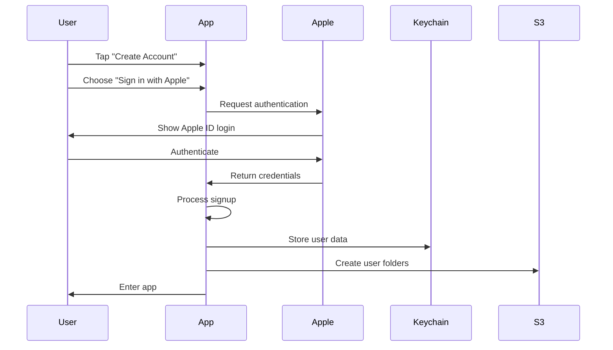
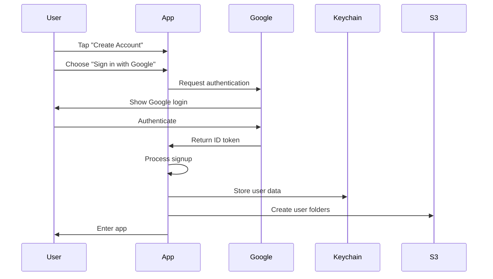

# Signup Process Technical Implementation

## Overview

This document details the technical implementation of the signup process in Photolala, from receiving authentication credentials (JWT/OAuth tokens) to creating the user's S3 storage structure.

## Authentication Provider Flows

### Sign in with Apple Flow



### Sign in with Google Flow



## Detailed Signup Process

### Step 1: Receive Authentication Credentials

#### Apple Authentication Response
```swift
// ASAuthorizationAppleIDCredential contains:
struct AppleCredential {
    let user: String              // Apple's unique user ID
    let email: String?            // May be nil or private relay
    let fullName: PersonNameComponents?  // Only provided first time
    let identityToken: Data?      // JWT token
    let authorizationCode: Data?  // One-time auth code
}

// Decode identity token (JWT)
func decodeAppleJWT(_ tokenData: Data) throws -> AppleJWTPayload {
    let tokenString = String(data: tokenData, encoding: .utf8)!
    let segments = tokenString.split(separator: ".")
    
    let payloadData = Data(base64Encoded: segments[1])!
    let payload = try JSONDecoder().decode(AppleJWTPayload.self, from: payloadData)
    
    return payload
}

struct AppleJWTPayload: Codable {
    let iss: String          // "https://appleid.apple.com"
    let aud: String          // Your app's bundle ID
    let exp: Int             // Expiration timestamp
    let iat: Int             // Issued at timestamp
    let sub: String          // User ID (same as credential.user)
    let email: String?       // User's email
    let email_verified: Bool?
    let is_private_email: Bool?
    let real_user_status: Int?  // 0: Unsupported, 1: Unknown, 2: Real
}
```

#### Google Authentication Response
```swift
// GIDGoogleUser contains:
struct GoogleCredential {
    let userID: String           // Google's unique user ID
    let email: String?           
    let emailVerified: Bool
    let fullName: String?
    let givenName: String?
    let familyName: String?
    let profilePicURL: URL?
    let idToken: String          // JWT token
    let accessToken: String      // OAuth access token
}

// Decode Google ID token (JWT)
func decodeGoogleJWT(_ tokenString: String) throws -> GoogleJWTPayload {
    let segments = tokenString.split(separator: ".")
    let payloadData = Data(base64Encoded: segments[1])!
    let payload = try JSONDecoder().decode(GoogleJWTPayload.self, from: payloadData)
    
    return payload
}

struct GoogleJWTPayload: Codable {
    let iss: String          // "https://accounts.google.com"
    let azp: String          // Authorized party (client ID)
    let aud: String          // Audience (client ID)
    let sub: String          // User ID (same as userID)
    let email: String
    let email_verified: Bool
    let name: String?
    let picture: String?     // Profile picture URL
    let given_name: String?
    let family_name: String?
    let iat: Int            // Issued at
    let exp: Int            // Expiration
}
```

### Step 2: Check for Existing Account via Identity Mapping

```swift
func checkExistingAccount(provider: AuthProvider, providerID: String) async throws -> PhotolalaUser? {
    // Check S3 identity mapping first
    let identityPath = "identities/\(provider.rawValue)/\(providerID)"
    
    do {
        // Try to get the UUID from identity mapping
        let getRequest = GetObjectRequest(
            bucket: "photolala",
            key: identityPath
        )
        
        let response = try await s3Client.getObject(getRequest)
        if let data = response.body?.asData(),
           let serviceUserID = String(data: data, encoding: .utf8) {
            // Found existing user, load their profile
            return try await loadUserProfile(serviceUserID: serviceUserID)
        }
    } catch {
        // 404 Not Found is expected for new users
        if error.isNotFound {
            return nil
        }
        throw error
    }
    
    return nil
}

func loadUserProfile(serviceUserID: String) async throws -> PhotolalaUser? {
    let profilePath = "users/\(serviceUserID)/account/profile.json"
    
    let getRequest = GetObjectRequest(
        bucket: "photolala",
        key: profilePath
    )
    
    let response = try await s3Client.getObject(getRequest)
    guard let data = response.body?.asData() else {
        throw SignupError.invalidProfileData
    }
    
    let decoder = JSONDecoder()
    decoder.dateDecodingStrategy = .iso8601
    return try decoder.decode(PhotolalaUser.self, from: data)
}
```

### Step 3: Generate Service User ID (UUID)

```swift
func generateServiceUserID() -> String {
    // Generate a new UUID for S3 storage
    // This is the permanent identifier for the user's data
    let uuid = UUID().uuidString.lowercased()
    
    // Log for debugging
    print("Generated new serviceUserID: \(uuid)")
    
    return uuid
}

// Example: "a1b2c3d4-e5f6-7890-abcd-ef1234567890"
```

### Step 4: Create PhotolalaUser Object

```swift
func createNewUser(from credential: AuthCredential) -> PhotolalaUser {
    let now = Date()
    
    let newUser = PhotolalaUser(
        // Core identity
        serviceUserID: generateServiceUserID(),  // Our S3 identifier
        primaryProvider: credential.provider,
        primaryProviderID: credential.providerID,
        
        // User information
        email: credential.email,
        fullName: credential.fullName,
        photoURL: credential.photoURL,
        createdAt: now,
        lastUpdated: now,
        
        // No linked providers yet
        linkedProviders: [],
        
        // Default subscription
        subscription: Subscription(
            tier: .free,
            startDate: now,
            expiryDate: now.addingTimeInterval(30 * 24 * 60 * 60), // 30 days trial
            storageLimit: 200 * 1024 * 1024, // 200MB
            storageUsed: 0
        ),
        
        // Default preferences
        preferences: UserPreferences(
            uploadQuality: .high,
            autoBackup: true,
            wifiOnlyBackup: true
        )
    )
    
    return newUser
}
```

### Step 5: Store User in Keychain

```swift
extension KeychainManager {
    func saveUser(_ user: PhotolalaUser) throws {
        // Encode user to JSON
        let encoder = JSONEncoder()
        encoder.dateEncodingStrategy = .iso8601
        let userData = try encoder.encode(user)
        
        // Create Keychain query
        let query: [String: Any] = [
            kSecClass as String: kSecClassGenericPassword,
            kSecAttrAccount as String: "com.electricwoods.photolala.user.\(user.serviceUserID)",
            kSecAttrService as String: "com.electricwoods.photolala",
            kSecValueData as String: userData,
            kSecAttrAccessible as String: kSecAttrAccessibleAfterFirstUnlock
        ]
        
        // Delete any existing item
        SecItemDelete(query as CFDictionary)
        
        // Add new item
        let status = SecItemAdd(query as CFDictionary, nil)
        
        if status != errSecSuccess {
            throw KeychainError.unableToStore
        }
        
        // Also store current user ID for quick access
        try saveCurrentUserID(user.serviceUserID)
    }
    
    private func saveCurrentUserID(_ userID: String) throws {
        let query: [String: Any] = [
            kSecClass as String: kSecClassGenericPassword,
            kSecAttrAccount as String: "com.electricwoods.photolala.currentUserID",
            kSecAttrService as String: "com.electricwoods.photolala",
            kSecValueData as String: userID.data(using: .utf8)!,
            kSecAttrAccessible as String: kSecAttrAccessibleAfterFirstUnlock
        ]
        
        SecItemDelete(query as CFDictionary)
        let status = SecItemAdd(query as CFDictionary, nil)
        
        if status != errSecSuccess {
            throw KeychainError.unableToStore
        }
    }
}
```

### Step 6: Create Identity Mapping and S3 Folder Structure

```swift
func createIdentityMapping(provider: AuthProvider, providerID: String, serviceUserID: String) async throws {
    let s3Client = try await S3Manager.shared.getClient()
    let bucket = "photolala"
    
    // Create identity mapping
    let identityPath = "identities/\(provider.rawValue)/\(providerID)"
    let putRequest = PutObjectRequest(
        bucket: bucket,
        key: identityPath,
        body: .data(serviceUserID.data(using: .utf8)!),
        contentType: "text/plain",
        metadata: [
            "created-at": ISO8601DateFormatter().string(from: Date()),
            "service-user-id": serviceUserID
        ]
    )
    
    _ = try await s3Client.putObject(putRequest)
}

func createS3UserFolders(for user: PhotolalaUser) async throws {
    let s3Client = try await S3Manager.shared.getClient()
    let bucket = "photolala"
    
    // Create identity mapping first
    try await createIdentityMapping(
        provider: user.primaryProvider,
        providerID: user.primaryProviderID,
        serviceUserID: user.serviceUserID
    )
    
    // Create folder structure by uploading placeholder files
    let folders = [
        "users/\(user.serviceUserID)/",
        "users/\(user.serviceUserID)/photos/",
        "users/\(user.serviceUserID)/thumbnails/",
        "users/\(user.serviceUserID)/metadata/",
        "users/\(user.serviceUserID)/account/"
    ]
    
    for folder in folders {
        // S3 doesn't have real folders, so we create a zero-byte object
        let putRequest = PutObjectRequest(
            bucket: bucket,
            key: folder,
            body: .empty,
            contentType: "application/x-directory"
        )
        
        _ = try await s3Client.putObject(putRequest)
    }
    
    // Upload initial user profile
    try await uploadUserProfile(user, to: s3Client)
    
    // Upload providers.json for reverse lookup
    try await uploadProvidersInfo(user, to: s3Client)
}

private func uploadUserProfile(_ user: PhotolalaUser, to s3Client: S3Client) async throws {
    let encoder = JSONEncoder()
    encoder.dateEncodingStrategy = .iso8601
    encoder.outputFormatting = .prettyPrinted
    
    let profileData = try encoder.encode(user)
    
    let putRequest = PutObjectRequest(
        bucket: "photolala",
        key: "users/\(user.serviceUserID)/account/profile.json",
        body: .data(profileData),
        contentType: "application/json",
        metadata: [
            "created-at": ISO8601DateFormatter().string(from: user.createdAt),
            "provider": user.primaryProvider.rawValue
        ]
    )
    
    _ = try await s3Client.putObject(putRequest)
}

private func uploadProvidersInfo(_ user: PhotolalaUser, to s3Client: S3Client) async throws {
    struct ProvidersInfo: Codable {
        let version: Int = 1
        let primaryProvider: String
        let providers: [ProviderInfo]
        
        struct ProviderInfo: Codable {
            let type: String
            let id: String
            let email: String?
            let displayName: String?
            let linkedAt: Date
            let lastUsed: Date
            let isPrimary: Bool
        }
    }
    
    let providersInfo = ProvidersInfo(
        primaryProvider: user.primaryProvider.rawValue,
        providers: [
            ProvidersInfo.ProviderInfo(
                type: user.primaryProvider.rawValue,
                id: user.primaryProviderID,
                email: user.email,
                displayName: user.fullName,
                linkedAt: user.createdAt,
                lastUsed: user.lastUpdated,
                isPrimary: true
            )
        ]
    )
    
    let encoder = JSONEncoder()
    encoder.dateEncodingStrategy = .iso8601
    encoder.outputFormatting = .prettyPrinted
    
    let data = try encoder.encode(providersInfo)
    
    let putRequest = PutObjectRequest(
        bucket: "photolala",
        key: "users/\(user.serviceUserID)/account/providers.json",
        body: .data(data),
        contentType: "application/json"
    )
    
    _ = try await s3Client.putObject(putRequest)
}
```

### Step 7: Complete Signup Flow

```swift
class SignupManager {
    func createAccount(with provider: AuthProvider) async throws -> PhotolalaUser {
        do {
            // 1. Authenticate with provider
            let credential = try await authenticateWithProvider(provider)
            
            // 2. Check if account already exists
            if let existingUser = try await checkExistingAccount(
                provider: provider,
                providerID: credential.providerID
            ) {
                throw AuthError.accountAlreadyExists
            }
            
            // 3. Create new user object
            let newUser = createNewUser(from: credential)
            
            // 4. Store in Keychain
            try KeychainManager.shared.saveUser(newUser)
            
            // 5. Create S3 folders
            try await createS3UserFolders(for: newUser)
            
            // 6. Update app state
            await MainActor.run {
                IdentityManager.shared.currentUser = newUser
            }
            
            // 7. Log analytics event
            Analytics.log(.accountCreated, [
                "provider": provider.rawValue,
                "serviceUserID": newUser.serviceUserID
            ])
            
            return newUser
            
        } catch {
            // Log error and clean up any partial state
            print("Signup failed: \(error)")
            throw error
        }
    }
}
```

## Error Handling

```swift
enum SignupError: LocalizedError {
    case authenticationFailed
    case accountAlreadyExists
    case s3CreationFailed
    case keychainStorageFailed
    case invalidCredentials
    case networkError
    
    var errorDescription: String? {
        switch self {
        case .authenticationFailed:
            return "Authentication failed. Please try again."
        case .accountAlreadyExists:
            return "An account already exists. Please sign in instead."
        case .s3CreationFailed:
            return "Failed to create storage. Please try again."
        case .keychainStorageFailed:
            return "Failed to save account locally."
        case .invalidCredentials:
            return "Invalid credentials received from provider."
        case .networkError:
            return "Network error. Please check your connection."
        }
    }
}
```

## Security Considerations

### 1. JWT Validation (Future Backend)
```swift
// When backend is implemented, validate JWTs server-side
func validateJWT(_ token: String, provider: AuthProvider) async throws -> Bool {
    // TODO: Send to backend for validation
    // - Verify signature with provider's public key
    // - Check expiration
    // - Verify audience matches our app
    // - Verify issuer is correct provider
    return true
}
```

### 2. Secure Storage
- All user data stored in Keychain with `kSecAttrAccessibleAfterFirstUnlock`
- S3 credentials use IAM policies scoped to user's folder
- No sensitive data in UserDefaults or plain files

### 3. Data Minimization
- Only store necessary user information
- Allow users to opt-out of profile photo storage
- Implement data deletion on account removal

## Testing Signup Flow

```swift
// Unit test example
func testSignupFlow() async throws {
    let mockCredential = AuthCredential(
        provider: .apple,
        providerID: "test-apple-id-123",
        email: "test@icloud.com",
        fullName: "Test User"
    )
    
    // Test user creation
    let user = createNewUser(from: mockCredential)
    XCTAssertEqual(user.primaryProvider, .apple)
    XCTAssertEqual(user.email, "test@icloud.com")
    XCTAssertNotNil(user.serviceUserID)
    
    // Test duplicate prevention
    // ... additional tests
}
```

## Migration Considerations

For users migrating from the current Sign in with Apple only system:
1. Existing users keep their current `serviceUserID`
2. Update user model to new structure on next sign-in
3. No changes to S3 folder structure needed
4. Seamless experience for existing users