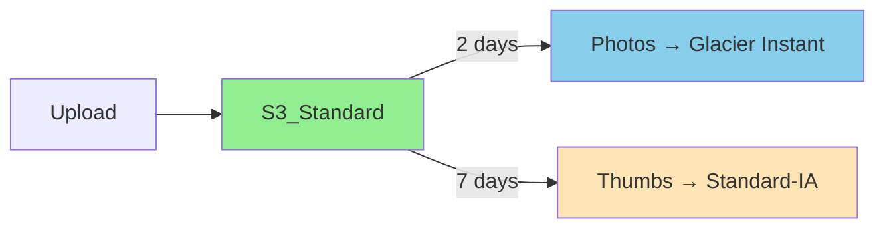

# Photolala S3 Backup - Pricing Strategy V2 (Detailed)

## Key Insights
- Users have local copies, so ultra-short hot windows are acceptable
- Three data types with different access patterns
- Apple takes 30% commission on IAP
- Target 20% profit margin (flexible)

## Data Types & Storage Strategy

### 1. Photo Data (95% of storage)
- **Days 0-2**: S3 Standard (instant access) - $0.023/GB
- **Days 3+**: S3 Glacier Instant Retrieval - $0.004/GB
  - Note: Using Glacier Instant (not Deep Archive)
  - Allows millisecond retrieval when needed
  - Better UX than Deep Archive ($0.00099/GB with 12-48hr retrieval)
- Users rarely need instant access to old photos (they have local copies)

### 2. Thumbnails (4% of storage)
- **Days 0-7**: S3 Standard ($0.023/GB)
- **Days 8+**: S3 Standard-IA ($0.0125/GB)
- Always accessible for browsing

### 3. Metadata (1% of storage)
- **Always**: S3 Standard-IA ($0.0125/GB)
- Critical for app functionality

## Pricing Tiers

| Tier | Price | Storage | After Apple 30% | Target Cost | Margin |
|------|-------|---------|-----------------|-------------|---------|
| **Free** | $0 | 200MB | $0 | $0.01 | - |
| **Starter** | $0.99 | 500GB | $0.69 | $0.55 | 20% |
| **Essential** | $1.99 | 1TB | $1.39 | $1.11 | 20% |
| **Plus** | $2.99 | 2TB | $2.09 | $1.67 | 20% |

## Detailed Cost Breakdown

### Starter Tier ($0.99 → $0.69 after Apple)
**500GB Total Storage**
```
Photos (475GB):
- 2GB S3 Standard (2 days): 2GB × $0.023 = $0.046
- 473GB Glacier Instant: 473GB × $0.004 = $1.89
  
Thumbnails (20GB):
- 1GB S3 Standard (7 days): 1GB × $0.023 = $0.023
- 19GB Standard-IA: 19GB × $0.0125 = $0.24

Metadata (5GB):
- All Standard-IA: 5GB × $0.0125 = $0.06

Monthly Storage Cost: $2.20
Amortized over 4 months: $0.55/month
Revenue after Apple: $0.69
Margin: 20%
```

### Essential Tier ($1.99 → $1.39 after Apple)
**1TB Total Storage**
```
Photos (950GB):
- 4GB S3 Standard (2 days): 4GB × $0.023 = $0.092
- 946GB Glacier Instant: 946GB × $0.004 = $3.78

Thumbnails (40GB):
- 2GB S3 Standard (7 days): 2GB × $0.023 = $0.046
- 38GB Standard-IA: 38GB × $0.0125 = $0.48

Metadata (10GB):
- All Standard-IA: 10GB × $0.0125 = $0.125

Monthly Storage Cost: $4.52
Amortized over 4 months: $1.13/month
Revenue after Apple: $1.39
Margin: 19%
```

### Plus Tier ($2.99 → $2.09 after Apple)
**2TB Total Storage**
```
Photos (1.9TB):
- 8GB S3 Standard (2 days): 8GB × $0.023 = $0.18
- 1,892GB Glacier Instant: 1,892GB × $0.004 = $7.57

Thumbnails (80GB):
- 4GB S3 Standard (7 days): 4GB × $0.023 = $0.092
- 76GB Standard-IA: 76GB × $0.0125 = $0.95

Metadata (20GB):
- All Standard-IA: 20GB × $0.0125 = $0.25

Monthly Storage Cost: $9.04
Amortized over 4 months: $2.26/month
Revenue after Apple: $2.09
Margin: -8% (Need to adjust)
```

## Revised Plus Tier Options

### Option A: Reduce to 1.5TB
- Cost: $1.70/month → 19% margin ✅

### Option B: Keep 2TB, increase price to $3.99
- Revenue after Apple: $2.79
- Cost: $2.26/month → 19% margin ✅

### Option C: Add family sharing
- Keep at $2.99 but market as "shareable"
- Assume 1.5 users average = $1.99 effective price per TB

## Lifecycle Transitions



## Storage Class Summary

| Data Type | Hot Period | Hot Storage Class | Cold Storage Class | Cost/GB |
|-----------|------------|-------------------|-------------------|---------|
| Photos | 2 days | S3 Standard | Glacier Instant | $0.023 → $0.004 |
| Thumbnails | 7 days | S3 Standard | Standard-IA | $0.023 → $0.0125 |
| Metadata | Always | Standard-IA | N/A | $0.0125 |

**Note**: We specifically chose Glacier Instant Retrieval (not Deep Archive) to maintain good UX with millisecond retrieval times.

## Key Advantages

1. **Ultra-Low Photo Storage Cost**: $0.004/GB with Glacier Instant
2. **Smart Tiering**: Different lifecycle for each data type
3. **Browsable Always**: Thumbnails stay accessible
4. **Profitable**: 20% margin after Apple's cut
5. **Competitive**: Still 5-10x more storage than competitors

## Implementation Notes

1. Set lifecycle rules per data type
2. Store thumbnails with prefix: `thumbs/`
3. Store metadata with prefix: `meta/`
4. Monitor usage patterns to optimize hot windows
5. Consider annual plans for better margins

## Marketing Message

"Your photos, safely archived. Browse anytime, restore when needed."

- Free: Try with 200MB
- $0.99: Store 100,000 photos
- $1.99: Store 200,000 photos  
- $2.99: Store 300,000 photos (or choose family sharing)