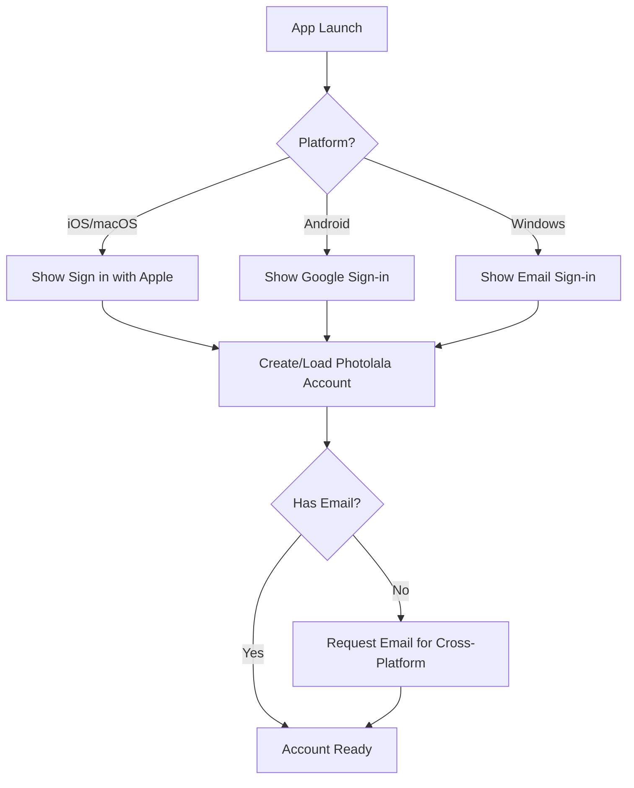

# Cross-Platform Identity Strategy for Photolala

## The Challenge

When expanding from Apple ecosystem to Windows/Android, we lose:
- Sign in with Apple (not available on all platforms)
- IAP (need different payment systems)
- Seamless Apple ID integration

## Platform-Specific Constraints

### Apple Platforms (iOS/macOS)
- ✅ Sign in with Apple available
- ✅ IAP for subscriptions
- ✅ Family Sharing support
- ⚠️ Must offer Sign in with Apple if offering other methods

### Android
- ❌ No Sign in with Apple (technically possible but poor UX)
- ✅ Google Play Billing
- ✅ Google Sign-In
- ✅ Family Library

### Windows
- ❌ No native Sign in with Apple
- ❌ No unified payment system
- ✅ Microsoft Account (optional)
- 💳 Need direct payment processing (Stripe, etc.)

## Solution Patterns

### Pattern 1: **Email-Based Universal Account** (Adobe Creative Cloud Model)

```
All Platforms → Email + Password → Universal Photolala Account
                        ↓
Platform-Specific Sign-in Options (Apple/Google/Microsoft)
                        ↓
Platform-Specific Payments (IAP/Play/Stripe)
```

**Implementation:**
```swift
enum AuthMethod {
    case email(String, password: String)
    case apple(userID: String)
    case google(userID: String)
    case microsoft(userID: String)
}

struct UniversalAccount {
    let photolalaID: String  // Our service ID
    let email: String        // Required for cross-platform
    let authMethods: [AuthMethod]  // Can have multiple
    let createdPlatform: Platform
}
```

### Pattern 2: **Platform Account Linking** (Spotify Model)

```
Start on Any Platform → Create Account → Link Other Platforms
```

**User Flow Example:**
1. **iOS User**: Signs in with Apple → Gets Photolala account
2. **Wants Windows Access**: 
   - Opens Windows app
   - "Already have an account? Sign in"
   - Enters email used with Apple ID
   - Receives magic link/code
   - Accounts linked

**Code Structure:**
```swift
class AccountLinkingService {
    func linkAccounts(primaryAccount: PhotolalaAccount, 
                     newPlatform: Platform,
                     newAuthMethod: AuthMethod) async throws {
        
        // Verify ownership via email
        let verificationCode = try await sendVerificationEmail(primaryAccount.email)
        
        // Link new auth method
        primaryAccount.authMethods.append(newAuthMethod)
        
        // Enable cross-platform access
        try await enableCrossPlatformSync(primaryAccount)
    }
}
```

### Pattern 3: **QR Code Linking** (WhatsApp Web Model)

```
Primary Device (iOS) → Generate QR → Scan on Secondary (Windows)
```

**Benefits:**
- No password needed
- Secure device linking
- Apple ID stays primary

## Recommended Architecture

### 1. **Identity Core**

```swift
struct PhotolalaIdentity {
    // Core identity
    let serviceID: UUID
    let primaryEmail: String
    let displayName: String?
    
    // Platform identities
    let appleUserID: String?
    let googleUserID: String?
    let microsoftUserID: String?
    
    // Auth methods
    let hasPassword: Bool
    let linkedPlatforms: [Platform]
    
    // Subscription (platform-agnostic)
    let subscription: UniversalSubscription?
}

struct UniversalSubscription {
    let tier: SubscriptionTier
    let expiresAt: Date
    let purchasePlatform: Platform
    let platformSpecificID: String  // Receipt ID, Order ID, etc.
}
```

### 2. **Authentication Flow**



### 3. **Payment Reconciliation**

```swift
enum PaymentPlatform {
    case appleIAP(receiptData: String)
    case googlePlay(purchaseToken: String)
    case stripe(subscriptionID: String)
    
    var validationEndpoint: String {
        switch self {
        case .appleIAP: return "/api/validate/apple"
        case .googlePlay: return "/api/validate/google"
        case .stripe: return "/api/validate/stripe"
        }
    }
}

class SubscriptionManager {
    func validateSubscription(_ payment: PaymentPlatform) async throws -> Bool {
        // Server-side validation for each platform
        // Returns unified subscription status
    }
}
```

## Implementation Phases

### Phase 1: Apple-First (Current)
```
iOS/macOS only → Sign in with Apple → IAP
```

### Phase 2: Add Email Option
```
iOS/macOS → Sign in with Apple OR Email → IAP
(Apple requires showing Sign in with Apple if other options exist)
```

### Phase 3: Android Launch
```
Android → Google Sign-in OR Email → Google Play Billing
Existing Apple users → Sign in with email → Access same account
```

### Phase 4: Windows Launch
```
Windows → Email sign-in → Stripe payments
OR → Link from mobile app via QR code
```

## Database Schema Evolution

```sql
-- Phase 1 (Apple only)
CREATE TABLE users (
    service_id UUID PRIMARY KEY,
    apple_user_id VARCHAR UNIQUE,
    created_at TIMESTAMP
);

-- Phase 2+ (Multi-platform)
CREATE TABLE users (
    service_id UUID PRIMARY KEY,
    email VARCHAR UNIQUE NOT NULL,  -- Now required
    display_name VARCHAR,
    created_at TIMESTAMP
);

CREATE TABLE auth_methods (
    id UUID PRIMARY KEY,
    user_id UUID REFERENCES users(service_id),
    platform VARCHAR NOT NULL,
    platform_user_id VARCHAR NOT NULL,
    UNIQUE(platform, platform_user_id)
);

CREATE TABLE subscriptions (
    id UUID PRIMARY KEY,
    user_id UUID REFERENCES users(service_id),
    platform VARCHAR NOT NULL,
    platform_transaction_id VARCHAR NOT NULL,
    tier VARCHAR NOT NULL,
    expires_at TIMESTAMP,
    UNIQUE(platform, platform_transaction_id)
);
```

## UI/UX Considerations

### Sign-in Screen Evolution

**Phase 1 (Apple Only):**
```
┌─────────────────────────┐
│    Welcome to Photolala │
│                         │
│  [ Sign in with Apple ] │
│                         │
│    Browse Locally →     │
└─────────────────────────┘
```

**Phase 2+ (Multi-Platform):**
```
┌─────────────────────────┐
│    Welcome to Photolala │
│                         │
│  [ Sign in with Apple ] │
│  [ Sign in with Google ]│
│  [ Sign in with Email ] │
│                         │
│    Browse Locally →     │
└─────────────────────────┘
```

### Account Settings (Multi-Platform)

```
┌─────────────────────────────┐
│ Account Settings            │
├─────────────────────────────┤
│ Email: user@example.com     │
│                             │
│ Linked Accounts:            │
│ ✅ Apple ID                 │
│ ✅ Google                   │
│ ➕ Add Microsoft            │
│                             │
│ Subscription: Premium       │
│ Purchased on: App Store     │
│ Expires: Dec 31, 2025       │
│                             │
│ [Manage Subscription]       │
└─────────────────────────────┘
```

## Security Considerations

### 1. Email Verification
```swift
func addEmailToAppleAccount(_ email: String) async throws {
    // Always verify email ownership
    let token = try await sendVerificationEmail(email)
    try await confirmEmailOwnership(token)
    
    // Now safe to use for cross-platform
}
```

### 2. Platform-Specific Tokens
```swift
struct SessionToken {
    let platform: Platform
    let token: String
    let expiresAt: Date
    
    var isValid: Bool {
        Date() < expiresAt
    }
}
```

### 3. Subscription Verification
- Always verify on backend
- Handle platform-specific receipt formats
- Prevent subscription sharing across platforms

## Migration Strategies

### For Existing Apple Users

1. **Soft Migration**
   - Continue working without email
   - Prompt when they want cross-platform

2. **Email Collection Campaign**
   ```swift
   struct CrossPlatformPrompt {
       static let message = """
       Want to access your photos on Windows or Android?
       Add an email to your account for cross-platform sync!
       
       [Add Email] [Not Now]
       """
   }
   ```

## Best Practices

### DO:
- ✅ Make email the universal identifier
- ✅ Allow platform-specific sign-in methods
- ✅ Validate subscriptions server-side
- ✅ Support account linking
- ✅ Maintain platform-specific UX patterns

### DON'T:
- ❌ Force password creation on Apple users
- ❌ Share subscriptions across app stores
- ❌ Require all platforms to use same auth
- ❌ Make assumptions about email from Apple ID

## Conclusion

The key to cross-platform success is:

1. **Email as universal ID** - But collected gracefully
2. **Platform-native auth** - Apple on iOS, Google on Android
3. **Unified backend** - One user, multiple auth methods
4. **Platform-specific payments** - Follow store rules
5. **Progressive enhancement** - Start simple, add platforms

This allows a user to:
- Start on iPhone with Sign in with Apple
- Add email when they want Windows access  
- Use same account everywhere
- Pay on their preferred platform
- Never lose their photos

The architecture supports expansion while maintaining the simplicity of the Apple-first experience.