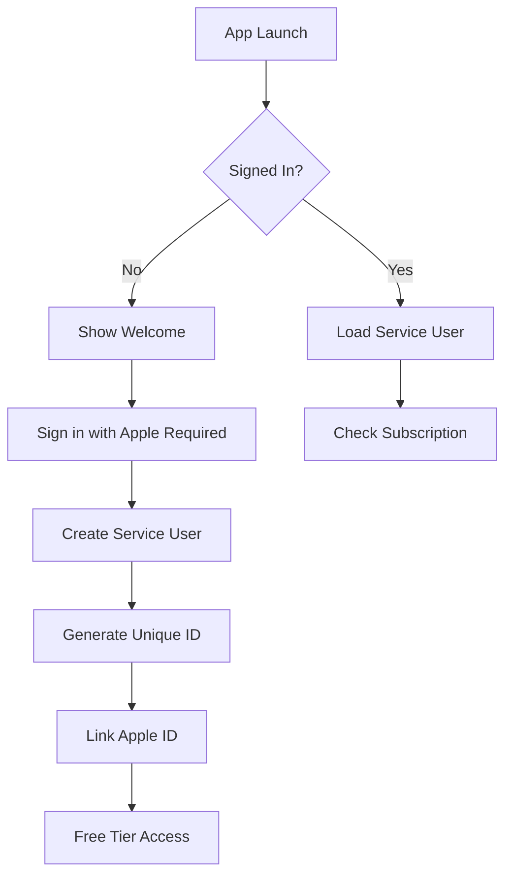
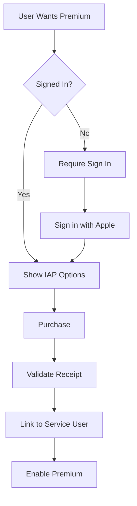
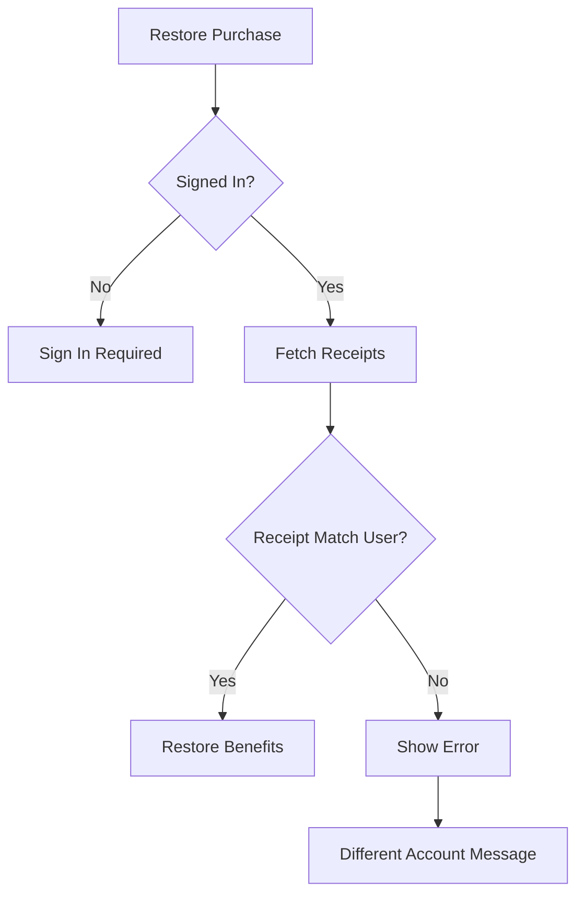

# Identity Management Design for Photolala S3 Backup Service

## Overview

This document outlines the identity management strategy for Photolala's S3 backup service, addressing the complexity of mapping Apple IDs, IAP receipts, and service user IDs.

## The Challenge

When integrating Apple ID authentication, In-App Purchases (IAP), and a custom backup service, we face several identity mapping challenges:

1. **Multiple Identity Sources**
   - Apple ID (from Sign in with Apple)
   - IAP Receipt User ID (from purchases)
   - Service User ID (our internal identifier)
   - Device ID (for anonymous users)

2. **Complex Scenarios**
   - User A purchases on device → User B signs in → Who owns the benefits?
   - Family sharing complications
   - Account switching and restoration

## Design Principles

1. **Single Source of Truth**: One service user ID owns all data and benefits
2. **Account-First**: Require authentication before any paid features
3. **Clear Ownership**: Purchases belong to accounts, not devices
4. **User Privacy**: Respect Apple's privacy guidelines
5. **Seamless Experience**: Minimize friction while maintaining security

## Architecture

### Identity Hierarchy

```
Service User ID (Primary)
    ├── Apple ID (Authentication)
    ├── IAP Receipt ID (Purchases)
    └── Device ID (Fallback/Analytics)
```

### Core Components

```swift
// User identity model
struct PhotolalaUser {
    let serviceUserID: String       // UUID, our primary key
    let appleUserID: String?        // From Sign in with Apple
    let email: String?              // If user grants permission
    let createdAt: Date
    let subscription: Subscription?
}

struct Subscription {
    let receiptID: String           // From IAP
    let productID: String           // Subscription tier
    let expiresAt: Date
    let originalPurchaseDate: Date
    let linkedServiceUserID: String // Prevents transfer
}
```

## User Flows

### 1. First-Time User Flow



### 2. Purchase Flow



### 3. Restore Purchase Flow



## Implementation

### 1. Identity Manager

```swift
import AuthenticationServices
import StoreKit

class IdentityManager: ObservableObject {
    static let shared = IdentityManager()
    
    @Published var currentUser: PhotolalaUser?
    @Published var isSignedIn: Bool = false
    
    private let keychainKey = "com.photolala.userID"
    
    // MARK: - Sign In with Apple
    
    func signIn() async throws {
        let appleIDProvider = ASAuthorizationAppleIDProvider()
        let request = appleIDProvider.createRequest()
        request.requestedScopes = [.email]
        
        // Perform sign in...
        // Create or fetch service user
        // Store in Keychain
    }
    
    // MARK: - Service User Management
    
    func createServiceUser(appleUserID: String) async throws -> PhotolalaUser {
        let serviceUserID = UUID().uuidString
        
        // Call your backend to create user
        let user = PhotolalaUser(
            serviceUserID: serviceUserID,
            appleUserID: appleUserID,
            email: nil,
            createdAt: Date(),
            subscription: nil
        )
        
        // Store in Keychain
        try KeychainManager.shared.save(
            serviceUserID.data(using: .utf8)!,
            for: keychainKey
        )
        
        return user
    }
    
    // MARK: - Purchase Linking
    
    func linkPurchase(receipt: String) async throws {
        guard let currentUser = currentUser else {
            throw IdentityError.notSignedIn
        }
        
        // Validate receipt with Apple
        // Link to service user ID
        // Update subscription status
    }
    
    // MARK: - Identity Validation
    
    func validateIdentity() async throws {
        // Check Keychain for stored user ID
        // Validate with backend
        // Refresh subscription status
    }
}

enum IdentityError: LocalizedError {
    case notSignedIn
    case purchaseMismatch
    case subscriptionExpired
    
    var errorDescription: String? {
        switch self {
        case .notSignedIn:
            return "Please sign in with Apple ID to continue"
        case .purchaseMismatch:
            return "This purchase belongs to a different Apple ID"
        case .subscriptionExpired:
            return "Your subscription has expired"
        }
    }
}
```

### 2. S3 Backup Integration

```swift
extension S3BackupManager {
    func getCurrentUserID() async throws -> String {
        guard let user = IdentityManager.shared.currentUser else {
            throw IdentityError.notSignedIn
        }
        
        // Use service user ID for S3 paths
        return user.serviceUserID
    }
    
    func uploadPhoto(_ photo: PhotoReference) async throws {
        let userID = try await getCurrentUserID()
        
        // Check subscription limits
        if let subscription = IdentityManager.shared.currentUser?.subscription {
            // Premium features
        } else {
            // Free tier limits
            throw S3BackupError.quotaExceeded
        }
        
        // Continue with upload...
    }
}
```

### 3. UI Integration

```swift
struct PhotoBrowserView: View {
    @StateObject private var identity = IdentityManager.shared
    
    var body: some View {
        // ... existing code ...
        .toolbar {
            if identity.isSignedIn {
                // Show backup button
            } else {
                Button("Sign In") {
                    Task {
                        try await identity.signIn()
                    }
                }
            }
        }
    }
}
```

## Database Schema

### Backend Requirements

```sql
-- Users table
CREATE TABLE users (
    service_user_id UUID PRIMARY KEY,
    apple_user_id VARCHAR(255) UNIQUE NOT NULL,
    email VARCHAR(255),
    created_at TIMESTAMP NOT NULL,
    updated_at TIMESTAMP NOT NULL
);

-- Subscriptions table
CREATE TABLE subscriptions (
    id UUID PRIMARY KEY,
    service_user_id UUID REFERENCES users(service_user_id),
    receipt_id VARCHAR(255) UNIQUE NOT NULL,
    product_id VARCHAR(255) NOT NULL,
    purchase_date TIMESTAMP NOT NULL,
    expires_at TIMESTAMP NOT NULL,
    is_active BOOLEAN DEFAULT true
);

-- Purchase history (for audit trail)
CREATE TABLE purchase_history (
    id UUID PRIMARY KEY,
    service_user_id UUID REFERENCES users(service_user_id),
    receipt_data TEXT NOT NULL,
    transaction_id VARCHAR(255) NOT NULL,
    created_at TIMESTAMP NOT NULL
);
```

## Security Considerations

### 1. Receipt Validation
- Always validate receipts server-side
- Store receipt data for audit trail
- Check expiration dates regularly

### 2. Identity Protection
- Use Keychain for sensitive data
- Implement certificate pinning for API calls
- Rate limit authentication attempts

### 3. Data Isolation
- Each service user has isolated S3 namespace
- Implement proper IAM policies
- No cross-user data access

## Edge Cases

### 1. Account Switching
```swift
func switchAccount() async throws {
    // Clear current session
    currentUser = nil
    
    // Clear Keychain
    try KeychainManager.shared.delete(key: keychainKey)
    
    // Clear cached data
    PhotoManager.shared.clearCache()
    
    // Require new sign in
    try await signIn()
}
```

### 2. Subscription Sharing (Family)
- Use Apple's Family Sharing APIs
- Backend validates family membership
- Shared storage quotas

### 3. Account Recovery
- Implement "Forgot Apple ID" flow
- Email-based recovery (if permitted)
- Support contact for edge cases

## Migration Strategy

For existing users without accounts:

1. **Soft Migration**
   ```swift
   func migrateAnonymousUser() async {
       // Detect anonymous usage
       if hasLocalPhotosButNoAccount() {
           // Prompt for sign in
           // Offer to backup existing photos
           // Link to new account
       }
   }
   ```

2. **Grace Period**
   - Allow read-only access for 30 days
   - Require sign in for new uploads
   - Send gentle reminders

## Best Practices

### DO:
- ✅ Require sign in before purchases
- ✅ Clearly communicate account requirements
- ✅ Store service user ID as primary key
- ✅ Validate all receipts server-side
- ✅ Handle expired subscriptions gracefully

### DON'T:
- ❌ Allow purchase without sign in
- ❌ Transfer benefits between accounts
- ❌ Store sensitive data locally
- ❌ Trust client-side validation
- ❌ Mix anonymous and authenticated data

## Error Handling

```swift
enum UserFlowError: LocalizedError {
    case signInRequired
    case subscriptionRequired
    case differentAccount(originalEmail: String)
    case quotaExceeded(limit: Int)
    
    var errorDescription: String? {
        switch self {
        case .signInRequired:
            return "Please sign in with your Apple ID to use cloud backup"
        case .subscriptionRequired:
            return "This feature requires an active subscription"
        case .differentAccount(let email):
            return "This purchase belongs to \(email)"
        case .quotaExceeded(let limit):
            return "Free accounts are limited to \(limit) photos"
        }
    }
    
    var recoverySuggestion: String? {
        switch self {
        case .signInRequired:
            return "Sign in to access your photos from any device"
        case .subscriptionRequired:
            return "Upgrade to Premium for unlimited storage"
        case .differentAccount:
            return "Sign in with the original purchasing account"
        case .quotaExceeded:
            return "Upgrade to Premium or delete some photos"
        }
    }
}
```

## Testing Strategy

### Unit Tests
- Identity creation and validation
- Receipt linking logic
- Error handling paths

### Integration Tests
- Sign in with Apple flow
- Purchase and restore flows
- Account switching

### Manual Testing Checklist
- [ ] New user sign up
- [ ] Existing user sign in
- [ ] Purchase subscription
- [ ] Restore purchase (same account)
- [ ] Restore purchase (different account)
- [ ] Account switching
- [ ] Subscription expiration
- [ ] Offline scenarios

## Conclusion

This identity management system provides:
- Clear ownership model
- Secure authentication
- Flexible subscription management
- Smooth user experience
- Future expansion capability

The key is requiring Sign in with Apple before any purchases, making the service user ID the primary identifier, and maintaining clear communication with users about account requirements.